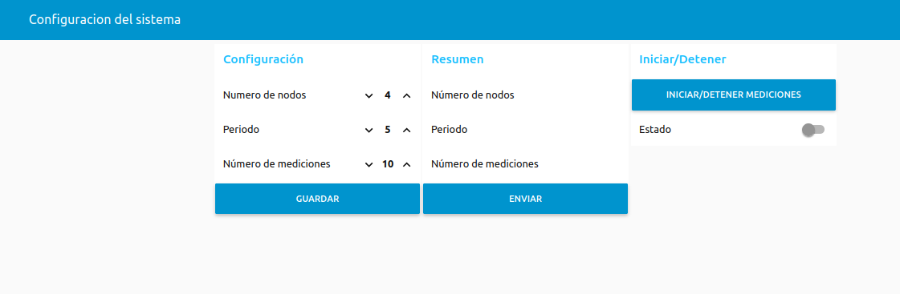

# Manual de Usuario - [Red de Sensores para el Monitoreo Acústico]

## Introducción
El presente sistema consiste en una red de sensores diseñados para monitorear el ruido acústico en tiempo real. La red está conformada por varios sonómetros basados en el microcontrolador LoRa32, un micrófono digital INMP441, y una batería recargable, todo alojado en una carcasa impresa en 3D.


La red utiliza una topología de estrella en la que los sonómetros se comunican directamente con un gateway central, que también está basado en un LoRa32. Este gateway actúa como puente entre los sensores y una computadora central, permitiendo la transferencia de datos de ruido en tiempo real. La conexión entre el gateway y la computadora puede realizarse mediante un enlace USB o el protocolo MQTT.


Los sonómetros son configurables a través de comandos enviados desde la computadora, lo que permite ajustar parámetros como el intervalo de medición y número de mediciones.

---

## Tabla de Contenidos
1. [Descripción del Hardware](#descripción-del-hardware)
1.1. [Componentes del sonómetro](#componentes-del-sonómetro)
1.2. [Gateway](#gateway)
1.3. [Esquema de conexión](#esquema-de-conexión)
2. [Programación de los Dispositivos](#programación-de-los-dispositivos)
3. [Uso de los Dispositivos](#uso-de-los-dispositivos)
3.1. [Mediante Conexión USB](#mediante-conexión-usb)
3.2. [Mediante Conexión MQTT](#mediante-conexión-mqtt)
4. [Registro y Visualización de los Niveles de Ruido](#registro-y-visualización-de-los-niveles-de-ruido)


---

## Descripción del Hardware
### Componentes del sonómetro
+ Tarjeta TTGO-LoRa32-V2.1 T3_V1.6 (LoRa32)
+ Micrófono INMP441
+ Batería recargable de 1200 o 2000 mAh

### Gateway
+ Tarjeta TTGO-LoRa32-V2.1 T3_V1.6 (LoRa32)

### Esquema de Conexión
**Diagrama de conexión entre el LoRa32 y el INMP441:**

**Especificaciones de pines utilizados**.

| LoRa32 | INMP441 |
|--------------|--------------|
| 12      | WS     |
| 0       |CLK    |
| 4       |SD|
| VDD      | LR    |
| VDD     | VDD   |
| GND     | GND   |


---

## Programación de los Dispositivos
Antes de comenzar, se debe de cumplir con los siguientes requisitos:
- **Sistema Operativo:** Windows, macOS o Linux.
- **Programas instalados:** 
  - Git
  - Arduino IDE 2 con la versión 2.0.17 del soporte de placas ESP32 y las siguientes librerías:
    - ArduinoJson.h
    - LoRa.h
    - ESP32Time.h
    - SSD1306Wire.h
    - PubSubClient.h

Una vez se cumplan con los requisitos se procede con la programación de los dispositivos siguiendo los siguientes pasos:

1. **Clonar el repositorio**
  Ejecuta el siguiente comando dentro de la carpeta de Arduino:
   ```bash
   git clone https://github.com/xavi2mil/Monitoreo-de-Ruido-en-Avenidass.git
2. **Cargar el sketch del sonómetro**
  El sketch se llama "*node_LoRa*" y es importante modificar la variable *nodeId* dentro del sketch. Se debe de usar un número que identifique al sonómetro (1, 2, 3, ...) y debe de ser distinto para cada uno:
  
3. **Cargar el sketch del gateway**
  Hay dos sketches para el gateway, uno para usarlo con el protocolo MQTT y el otro para usarlo con la conexión USB serial.
3.1. **MQTT**
  Modifica el archivo *config.h*, que está dentro de la carpeta gateway_LoRa, con los parametros de tu servidor MQTT y carga el sketch "*gateway_LoRa*" en la tarjeta LoRa32.
3.2. **USB**
  Carga el sketch "*gateway_LoRa_2*" en la tarjeta LoRa32.


---

## Uso de los Dispositivos
Los sonómetros son controlados mediante comandos que se envían a través del gateway y en formato JSON. Los comandos son los siguientes:

| Comando | Descripción | Formato JSON |
|---------|-------------|--------------|
| **setTime** | Establece el tiempo actual. El parámetro nodeId índica el número del sonómetro al cual está dirigido el comando, 0 es la dirección para todos los nodos. El valor del tiempo debe de estar en formato UNIX.| `{"command":"setConfig", "nodeId":0, "time":1736849056}` |
| **setConfig** |Establece los parámetros de las mediciones de ruido| `{"command":setConfig, "nodeId":0, "period":1, "numMeasurements":10}` |
| **getConfig** |Pide a un sonómetro su configuración actual.| `{"command":"getConfig", "nodeId":1}` |
|**getValues**|Pide los valores de ruido que tengan registrados y listos para enviar.|`{"command":"getValues", "nodeId":1}` |
|**startMeasurements**| Indica a los sonómetros cuando iniciar las mediciones de ruido.| `{"command":"startMeasurements", "nodeId":1}`  |
|**stopMeasurements**| Indica a los sonómetros cuando detener las mediciones de ruido.| `{"command":"stopMeasurements", "nodeId":1}`  |


Estos comandos se envían al gateway en formato JSON a través de la conexión USB o por el protocolo MQTT.
### Mediante Conexión USB 
Los comandos pueden ser enviados a través del monitor serial del Arduino IDE. El puerto serial se configura con un Baud Rate de 115200.
### Mediante Conexión MQTT

---

## Registro y Visualización de los Niveles de Ruido
En la carpeta de *flows_nodered* se encuentra un archivo JSON que contienen los nodos que se deben de importar desde node-red. Esta serie de nodos crean un programa con el cual se puede configurar a los sonómetros y registrar las mediciones de los mismos.

Antes de importar los nodos es importan cumplir con los siguientes requisitos:

- **InfluxDB2**
- **node-red** 
- **Broker MQTT (Mosquitto)**

El programa permite interactuar con los sonometros usando la siguiente interfaz gráfica:

El proceso para configurar los sonómetros y registrar las mediciones es el siguiente:
1. **Configuración**: Se establece la configuración que van a tener los sonómetros.
2. **Enviar**: En la sección de resumen se muestra la configuración previa de los sonómetros.
3. **Iniciar**: Se inicia el proceso en el cual se manda el comando *getValues* a cada nodo registrado de forma periódica y se registran esos valores en la base de datos InfluxDB.
4. **Detener**: Se detiene el proceso.


---