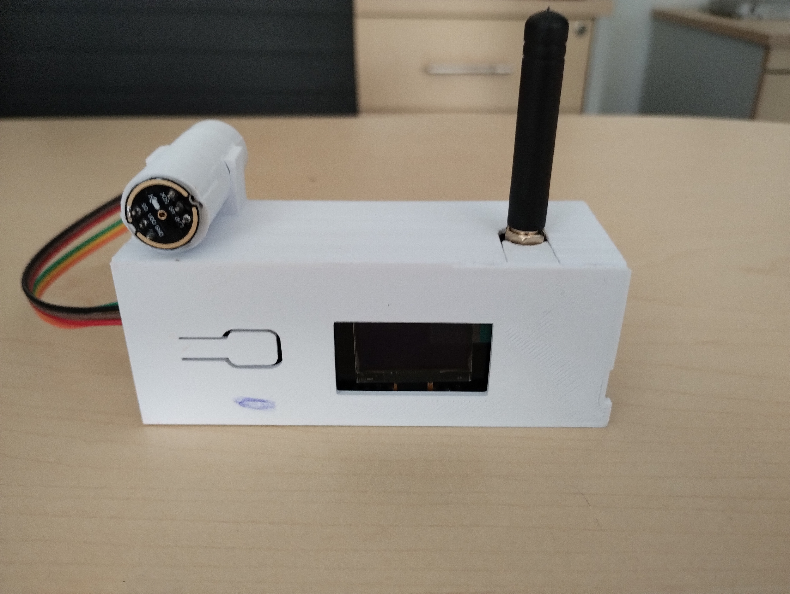

# Manual de Usuario - [Red de Sensores para el Monitoreo Acústico]

## Introducción
El presente sistema consiste en una red de sensores diseñados para monitorear el ruido acústico en tiempo real. La red está conformada por varios sonómetros basados en el microcontrolador LoRa32, un micrófono digital INMP441, y una batería recargable, todo alojado en una carcasa impresa en 3D.



La red utiliza una topología de estrella en la que los sonómetros se comunican directamente con un gateway central, que también está basado en un LoRa32. Este gateway actúa como puente entre los sensores y una computadora central, permitiendo la transferencia de datos de ruido en tiempo real. La conexión entre el gateway y la computadora puede realizarse mediante un enlace USB o el protocolo MQTT.


Los sonómetros miden el nivel equivalente de ruido (**Leq**) cada segundo. Sin embargo, para optimizar la transmisión mediante LoRa, los valores de **Leq** se almacenan localmente junto con su marca de tiempo. Esto permite enviar los datos en intervalos más grandes, reduciendo la frecuencia de transmisión y facilitando la recolección de datos.

Los parámetros configurables desde la interfaz gráfica de Node-RED son:
- El período de tiempo para calcular el **Leq**.
- El número de mediciones almacenadas antes de enviarlas mediante LoRa.
- El número total de nodos a los que se solicitarán valores. La numeración de los nodos debe ser secuencial, de 1 a *n*.

Además, los datos recolectados se almacenan en una base de datos **InfluxDB** para su análisis posterior.

---

## Tabla de Contenidos
1. [Descripción del Hardware](#descripción-del-hardware)
2. [Programación de los Dispositivos](#programación-de-los-dispositivos)
3. [Uso de los Dispositivos](#uso-de-los-dispositivos)
   3.1. [Configuración inicial](#configuración-inicial)
   3.2. [Mediante Conexión USB](#mediante-conexión-usb)
   3.3. [Mediante Conexión MQTT](#mediante-conexión-mqtt)
4. [Registro y Visualización de los Niveles de Ruido](#registro-y-visualización-de-los-niveles-de-ruido)
   4.1 [Requisitos](#requisitos)
   4.2 [Pasos para ejecutar el programa](#pasos-para-ejecutar-el-programa)
   4.3 [Interfaz gráfica](#interfaz-gráfica)
   4.4 [Visualización de datos](#visualización-de-datos)
   4.5 [Exportar datos](#exportar-datos)
5. [Solución de Problemas](#solución-de-problemas)
<!-- 5. [Solución de Problemas](#solución-de-problemas) -->

---

## Descripción del Hardware
1. Componentes del sonómetro
   + Tarjeta TTGO-LoRa32-V2.1 T3_V1.6 (LoRa32)
   + Micrófono INMP441
   + Batería recargable de 1200 o 2000 mAh

2. Gateway
   + Tarjeta TTGO-LoRa32-V2.1 T3_V1.6 (LoRa32)

**Diagrama de conexión entre el LoRa32 y el INMP441:**


**Especificaciones de pines utilizados**.

| LoRa32 | INMP441 |
|--------------|--------------|
| 12      | WS     |
| 0       | CLK    |
| 4       | SD     |
| VDD     | VDD    |
| GND     | GND    |

---

## Programación de los Dispositivos
Para programar los dispositivos se usa el software de Arduino IDE v2.
El repositorio del proyecto se encuentra en la siguiente [liga](https://github.com/xavi2mil/Monitoreo-de-Ruido-en-Avenidass.git). 
En este repositorio se encuentra el código para los sonómetros, el gateway y un programa en node-red que sirve para la configuración y uso de los sonómetros desde una interfaz gráfica.

**Pasos**:

1. **Descargar el repositorio**:
   se accede a la siguiente [liga](https://github.com/xavi2mil/Monitoreo-de-Ruido-en-Avenidass.git) y se da clic en Code y luego en download ZIP y se descomprime dentro de la carpeta de Arduino. 
   
    

2. **Instalar las librerías**:
Desde el IDE, en la sección *Gestor de bibliotecas* se buscan e instalan las siguientes librerías:

   - [ArduinoJson.h](https://github.com/bblanchon/ArduinoJson)
   - [LoRa.h](https://github.com/sandeepmistry/arduino-LoRa)
   - [ESP32Time.h](https://github.com/fbiego/ESP32Time)
   - [SSD1306Wire.h](https://github.com/ThingPulse/esp8266-oled-ssd1306)
   - [PubSubClient.h](https://github.com/EFWob/ESPPubSubClientWrapper)

3. **Instalar el soporte para las placas ESP32**:
Desde el IDE, en la sección **GESTOR DE PLACAS**, buscar e instalar el gestor `esp32 de *Espressif Systems*` en su **versión 2.0.17**.

   

4. **Cargar el sketch del sonómetro**
   - El sketch se llama `node_LoRa` y es importante modificar la variable *nodeId* dentro del sketch:
   
      
   - Se debe asignar un número único a cada sonómetro (1, 2, 3, ...).
     
5. **Cargar el sketch del gateway**:
Hay dos sketches diferentes para el gateway. Uno para usarlo a través del protocolo MQTT y otro para usarlo mediante la comunicación USB serial:
   1. **MQTT:** 
   Dentro de la carpeta `gateway_LoRa` crea un archivo con el nombre `config.h` y dentro escribe las credenciales de acceso para la conexión wifi y la conexión a tu servidor MQTT. El archivo debe de verse así:
      ``` C
      #define SSID        "nombre de la red"
      #define PASSWORD    "contraseña de la red"
      #define MQTT_SERVER "direccion IP del broker MQTT"
      #define PORT        1883 // puerto del broker

   2. **Serial USB:** 
   Carga el sketch `gateway2` directamente.

---

## Uso de los Dispositivos
### Configuración inicial
Los sonómetros son controlados mediante comandos enviados a través del gateway en formato JSON. Los comandos principales son:

| Comando | Descripción | Formato JSON |
|---------|-------------|--------------|
| **setTime** | Establece el tiempo actual. | `{"command":"setTime", "nodeId":0, "time":1736849056}` |
| **setConfig** | Configura parámetros como el período de cálculo y el número de mediciones. | `{"command":"setConfig", "nodeId":0, "period":1, "numMeasurements":10}` |
| **getConfig** | Solicita la configuración actual de un nodo. | `{"command":"getConfig", "nodeId":1}` |
| **getValues** | Solicita los valores de ruido almacenados. | `{"command":"getValues", "nodeId":1}` |
|**startMeasurements**| Indica a los sonómetros que deben de iniciar a guardar las mediciones | `{command:"startMeasurements", nodeId:0}` |
|**stoptMeasurements**| Indica a los sonómetros que deben dejar de guardar las mediciones | `{command:"stopMeasurements", nodeId:0}` |

Estos comandos pueden enviarse mediante conexión USB o MQTT.

### Mediante Conexión USB
Interactúa con los dispositivos de la siguiente manera:

1. Conecta el gateway a la computadora mediante un cable USB.
2. Usa el monitor serial del Arduino IDE configurado a 115200 Baud.
3. Envía los comandos JSON directamente desde el monitor.

**Ejemplo**:
Ejemplo:

La siguiente imagen ilustra cómo se puede interactuar con los sonómetros a través del gateway utilizando el monitor serie del IDE de Arduino. Todos los mensajes enviados al gateway mediante la conexión serial, así como los que recibe vía LoRa, se imprimirán en el monitor serie. Para distinguir su origen, los mensajes recibidos por USB se mostrarán con una "M" al inicio.

El primer comando enviado fue `{"command":"getInfo", "nodeId":1}`, y la respuesta recibida del sonómetro fue:

`{"battery":4.42337, "period":1, "numMeasurements":10, "nodeId":1}`

Esta respuesta muestra la configuración predeterminada del sonómetro junto con el voltaje de su batería.

Para modificar la configuración, se utilizó el siguiente comando:

`{"command":"setConfig", "period":3, "numMeasurements":5, "node":0}`

Este comando establece un período de 3 y un número de mediciones de 5 para todos los sonómetros (`"node":0`).

Posteriormente, se ejecutó nuevamente el comando `{"command":"getInfo", "nodeId":1}`, y la respuesta del sonómetro reflejó los nuevos valores:

`{"battery":4.292176, "period":3, "numMeasurements":5, "nodeId":1}`


Con los comandos anteriores hemos configurado al sonómetro 1 con un periodo de medición de 3 segundos y con una retención de 5 mediciones, lo que significa que tendrá mediciones nuevas cada 15 segundos.

#### Preparar las mediciones

Antes de solicitar las mediciones hay que indicarle al nodo que empiece a guardar las mediciones con el comando `startMeasurements` como se muestra en la siguiente imagen:


El comando debe de enviarse una vez que todos los sonómetros que se quieren usar estén encendidos, de esta forma todas las mediciones de los sonómetros empezaran al mismo tiempo.
Del lado del sonómetro si lo conectamos a la computadora veremos que imprime las mediciones que va guardando y además un vector con las estampas de tiempo de cada medición.


Si observamos las estampas de tiempo se aprecia que tienen una diferencia de 3 segundos que es justo como se ha configurado el sistema.


#### Ajuste de fecha y hora en los sonómetros
Ahora toca actualizar la fecha y hora actual en el sonómetro. Para hacerlo se debe de obtener la fecha y hora actual en formato UNIX y mandarla al sonómetro usando el comando `setTime` de la siguiente manera:


Del lado del sonómetro se mostrará un mensaje de que el Tiempo (fecha) ha sido actualizado:


En la imagen anterior se observa que en las mediciones que se obtuvieron después de establecer el tiempo ya tienen la hora actualizada. **Es importante ajustar la hora del sonómetro antes de solicitar las mediciones.**

#### Solicitud de las mediciones

La solicitud de mediciones se hace con el comando `getValues` de la siguiente manera:


en la imagen anterior se envió el comando `getValues` al sonómetro 1 y en la siguiente línea se muestra el mensaje que envió el sonómetro el cual contiene las últimas 5 mediciones junto con sus estampas de tiempo. 
### Mediante Conexión MQTT
<!-- Añadir detalles sobre cómo enviar comandos y recibir datos mediante MQTT -->

---

## Registro y Visualización de los Niveles de Ruido
Esta sección describe el funcionamiento del programa desarrollado en Node-Red el cual provee una interfaz gráfica con la que se pueden configurar los sonómetros de una manera sencilla, además registra las mediciones de los sonómetros en una base de datos de InfluxDB.

### Requisitos
Es necesario tener instalado [Node-RED](https://nodered.org/docs/getting-started/) e [InfluxDB](https://docs.influxdata.com/influxdb/v2/) version 2.7. En caso de que se quiera usar el gateway en modo MQTT se debe de tener instalado un broker MQTT, por ejemplo [Mosquitto](https://mosquitto.org/download/).

Una vez instalados la forma predeterminada para abrir los programas es:
+ **Node-RED**: Escribir el comando `node-red` en la terminal o cmd. Después, desde el navegador, ir a la dirección `localhost:1880`.
+ **InfluxDB**.
   
   + En Windows se debe de ejecutar el programa desde el el cmd. La ubicacion por defecto del programa es 'C:\Program Files\InfluxData\influxdb' y una vez ubicados en esa ruta se debe de ejecutar el comando `./influxd`. 
   + En Linux por defecto el servicio está activado siempre.
   + Desde el navegador ir a la dirección `localhost:8086`


### Pasos para ejecutar el programa:
   1. **Instalar los complementos necesarios para Node-Red**: Se necesita instalar los siguientes complementos en Node-Red desde la sección de "Manage palette":
      + node-red-contrib-influxdb
      + node-red-dashboard
      + node-red-node-serialport
   
   2. **Importar los nodos del prograam**: Se encuentran en el archivo flows.json dentro de la carpeta flows_nodered del repositorio
   3. **Configurar los nodos de comunicación serial**:
   Después de haber importado correctamente los nodos, se deben de configurar aquellos que se encarga de la comunicación serial. Para ello es necesario conocer el puerto al cual se conectó el gateway, por ejemplo COM4 en Windows o /dev/ttyACM0 en Linux y establecer la velocidad de comunicación en 115200 baudios.
      1. Seleccionar cualquier nodo de comunicación serial y ajustar los parámetros de conexión:
         + 
         + 
         + 
      2. Asegurarse de que la conexión serial ha quedado establecida: Dentro de la pestaña "Monitoreo de ruido" se encuentran los siguientes nodos que sirven para activar o desactivar la comunicación serial en el puerto configurado previamente. Para activarlo se debe de dar clic en el nodo de **{"enable":true}**:
         + 
      
   2. **Configurar los nodos de conexión a la base de datos**: Previo a configurar los nodos es necesario conocer los siguientes datos de la base de datos:
      + Dirección IP
      + Puerto
      + Nombre de la organización
      + Nombre del bucket
      + Token de seguridad

      Si tienes dudas sobre como obtener o generar los datos anteriores da clic en la [liga](https://docs.influxdata.com/influxdb/v2/) donde se detalla el proceso de instalación y configuración inicial de la base de datos InlfluxDB v2.
         
         1. Buscar el nodo de la base de datos influxDB:

            
         2. Dar clic en el nodo e ingresar el nombre del bucket y el nombre de la organización:

            
         3. Después en servidor dar clic en editar y colocar la dirección de la base de datos, el puerto y el token. Además seleccionar la versión 2.

            

### Interfaz gráfica
La interfaz gráfica se accede desde la dirección: `localhost:1880/ui`.


Desde aquí se pueden ajustar los parámetros de medición de los sonómetros. En la sección de **Configuración** se ajustan los parámetros, después se da clic en el botón **GUARDAR**. En la sección de Resumen se muestra la configuración guardada en el programa, si todo está correcto se da clic en el botón **ENVIAR**, esta acción enviara a los nodos la configuración. Por último la sección **INICIAR/DETENER** sirve para iniciar o detener la solicitud de las mediciones a los sonómetros y abajo se muestra si el sistema está activo.

### Visualización de datos

Se accede a la interfaz gráfica de Influx y despues de iniciar sesión se hace lo siguiente:
1. Se accede a la sección **DATA EXPLORER**.
2. Después se selecciona el bucket donde están alojados los datos, la medición leq y el numero identificador de los sonómetros (nodos) de los que se quiera ver los datos, para ver todos no se debe seleccionar nada:
      + 
3. Seleccionar el rango de tiempo de la medición:
      + 
4. Observar la gráfica:
      +  

### Exportar datos
Los datos de la gráfica anterior se pueden descargar en formato .CSV dando clc en el boton de **Dowload query results as a .CSV file**:


---
## Solución de Problemas

| Problema | Solución |
| :---- | :---- |
| No se establece la conexión entre el gateway y el servidor. | Verifica que el gateway esté cargado con el sketch correcto. <br>Si estás usando el gateway conectado por USB, asegúrate de configurar el puerto correctamente en Node-RED. <br>Si estás usando el gateway con el protocolo MQTT, conéctalo a la computadora usando un cable usb y abre el monitor serial para ver los mensajes de depuración. Reinicia el gateway y observa si se establece la conexión wifi y la conexión MQTT. Si no se establece alguna de estas conexiones entonces verifica que el archivo config.h esté con los parámetros de conexión correctos. En el programa de node-RED verifica que el nodo de conexión MQTT esté configurado correctamente. |
| No se reciben datos en InfluxDB. | Asegúrate de que el nodo InfluxDB esté configurado correctamente y la base de datos esté activa.  <br>Asegurarse que el token que se está usando tiene premios de escritura en el bucket donde se guardan los datos. <br>Verifica de aplicar un correcto rango de tiempo para la observación de datos. |
| Los datos observados en la gráfica de Influx no concuerdan con las mediciones realizadas | Asegúrate de poner una ventana de observación adecuada. Para ver los datos verdaderos pon una ventana de 1 segundo. |
| Uno o más sonómetros no están registrando datos. | Asegúrate de que el sonómetro esté encendido y que su batería esté cargada. <br>Puede que a los sonómetros que no están enviando datos no les haya llegado la señal que indica que comiencen a guardar mediciones o que no tengan configurada su hora y fecha, para remediarlo reinicia el proceso de solicitud de mediciones|
| Poca duración de la batería | Cada sonómetro tiene la capacidad de realizar mediciones continuas por más de 20 horas. De no ser el caso intenta lo siguiente: Deja cargando el sonómetro hasta que la luz indicadora de carga se apague. La tarjeta LoRa32 tiene tres leds integrados, en la parte superior junto a su antena están dos leds uno rojo y otro azul, el led azul es el que indica si la batería aún se está cargando. <br>Cambiar la batería por una nueva de mayor capacidad.|
--- --