# Sonómetro con conexión WIFI

Este sketch permite que el sonómetro funcione utilizando la conexión WiFi del LoRa32 y el protocolo MQTT para el envío de datos.

Antes de cargar el sketch al LoRa32, es necesario incluir un archivo llamado `config.h`, el cual debe contener los parámetros de conexión a la red WiFi y al broker MQTT. Este archivo debe incluir las siguientes variables:

```c
#define SSID            "nombre de la red WiFi"
#define PASSWORD        "contraseña de la red"
#define MQTT_SERVER     "dirección del broker MQTT"
#define PORT            1883    // Puerto del broker
#define MQTT_USER_NAME  ""      // Opcional
#define MQTT_PASSWORD   ""      // Opcional
```

---
## Temas (Topics MQTT)

Las siguientes tablas muestran los temas en los cuales el sonómetro publica o se suscribe, junto con una descripción del mensaje esperado.

### Publicaciones
| Tema                 | Descripción |
|----------------------|-----------------------------------------------------------------|
| `sono/measurements`  | Publica un JSON con las mediciones, sus marcas de tiempo y el identificador del sonómetro. |
| `sono/info/response` | Publica un JSON con la configuración del sonómetro y el voltaje de la batería. |

### Suscripciones
| Tema                 | Descripción |
|----------------------|-----------------------------------------------------------------|
| `sono/setConfig`          | Recibe un JSON con la configuración del número de mediciones y el período de muestreo. |
| `sono/setTime`            | Recibe la fecha y hora actuales en formato Unix. |
| `sono/info/request`       | Recibe una solicitud de información del sonómetro, incluyendo su identificador. |
| `sono/startMeasurements`  | Recibe un comando para iniciar (`true`) o detener (`false`) la toma de mediciones. |

---

## Ejemplo de Uso con Node-RED

A continuación, se muestra cómo enviar y recibir mensajes al sonómetro utilizando Node-RED.

### 1. Configuración del Broker MQTT
Para este ejemplo, se utilizará el broker público de **EMQX**: `broker.emqx.io`.

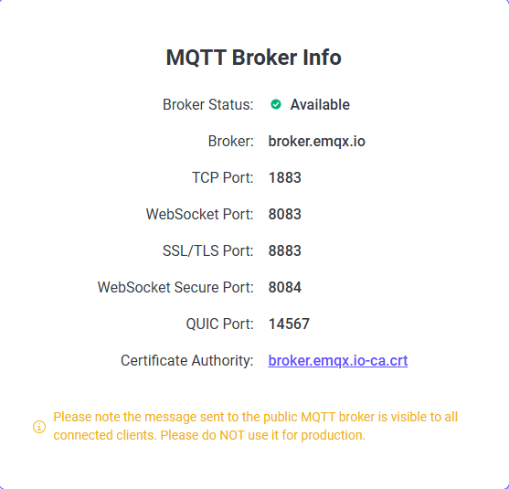

### 2. Creación del Archivo `config.h`
El archivo debe contener las credenciales de la red WiFi y del broker MQTT:
```c
#define MQTT_SERVER     "broker.emqx.io"
#define PORT            1883    
#define MQTT_USER_NAME  ""
#define MQTT_PASSWORD   ""
```

### 3. Configuración del Sonómetro
Se debe asignar un identificador único al sonómetro editando la línea 11 del sketch `node_wifi.ino`:
```c
const uint8_t nodeId = 1;
```
Luego, compila y carga el sketch al sonómetro.

### 4. Verificación de la Conexión
El sonómetro imprimirá en el puerto serial el estado de su conexión WiFi y su conexión con el broker MQTT. Si no logra conectarse, revisa la información en `config.h`.

### 5. Solicitar Información del Sonómetro
1. Inicia Node-RED y ábrelo en el navegador.
2. Inserta un nodo `inject` y conéctalo a un nodo `mqtt out`.
3. Configura el nodo `inject` con el identificador del sonómetro y el nodo `mqtt out` para publicar en `sono/info/request`.

    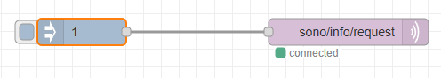

4. El nodo `mqtt out` debe de estar configurado con la información de tu broker MQTT, en este caso se usaron los parámetros del broker de **EMQX**.
    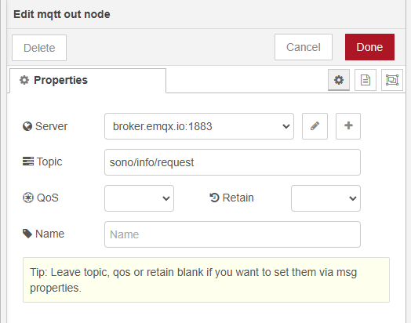

### 6. Recibir la Respuesta del Sonómetro
1. Agrega un nodo `mqtt in` suscrito al tema `sono/info/response`.
2. Conéctalo a un nodo `debug` para visualizar los mensajes recibidos.

    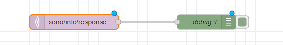

3. Da clic en Deploy y luego en el nodo de "inject". Deberás de observar en la salida de debug un mensaje en formato JSON con la información del sonómetro.
    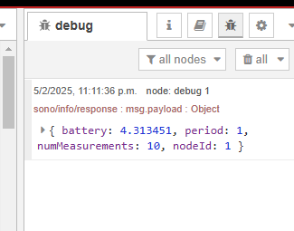
El mensaje que envió el sonómetro indica que está configurado con un periodo de un segundo y que guarda 10 mediciones. Esta es la configuración por defecto.

### 7. Cambiar la Configuración del Sonómetro
Para modificar la configuración, agrega un nodo `mqtt out` que publique en `sono/setConfig`.
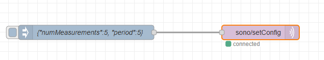
El mensaje JSON debe ser similar a este:
```json
{"numMeasurements":5, "period":5}
```
Al dar clic en el nodo de "inject" la configuración le llegará al sonómetro y este se reconfigurará con la nueva configuración. Para comprobarlo debemos de volver a dar clic en el nodo de inject que se creó en el paso 5. En la sección de debug podremos ver la nueva configuración del sonómetro:
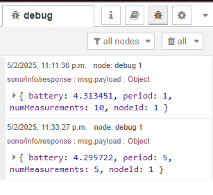
El nuevo mensaje muestra que el periodo es de 5 segundos y que el número de mediciones que guarda es de 5.

### 8. Configurar Fecha y Hora
El sonómetro utiliza tiempo en formato **epoch (segundos)**, por lo que es necesario convertir el tiempo en milisegundos antes de enviarlo. Para esto:
1. Usa un nodo `inject` que genere la marca de tiempo actual.
2. Conéctalo a un nodo de función que divida el valor entre 1000.
3. Envíalo a un nodo `mqtt out` que publique en `sono/setTime`.

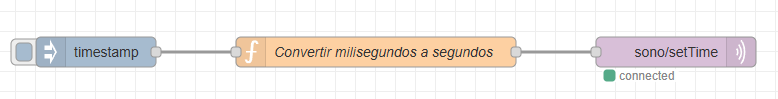

### 9. Iniciar y Detener Mediciones
Para iniciar las mediciones, publica `true` en `sono/startMeasurements`. Para detenerlas, publica `false`.

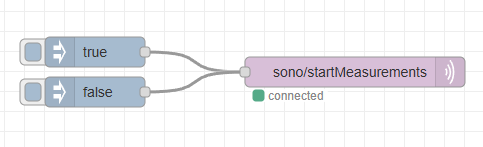

### 10. Recibir Mediciones
Para recibir mediciones del sonómetro:
1. Suscríbete al tema `sono/measurements` con un nodo `mqtt in`.
2. Conéctalo a un nodo `debug` para visualizar los datos recibidos.

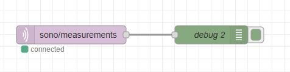

Cada mensaje será un JSON con los valores de ruido, sus marcas de tiempo y el identificador del sonómetro:
```json
{"values":[43.25168373,43.06545587,43.64942583,43.79637275,43.87787174],
"time":[1738910230,1738910235,1738910240,1738910245,1738910250],
"nodeId":1}
```
### 11. Guardar Mediciones en una Base de Datos
Usaremos la base de datos InfluxDB versión 2, para ello:
1. Descarga los nodos necesarios para usar la base de datos desde Node-RED. El módulo que contiene los nodos se llama `node-red-contrib-influxdb`.
2. Inserta un nodo `influxdb out` y configúralo con los parámetros de tu base de datos.
3. De acuerdo con la descripción del nodo `influxdb out`, es necesario modificar el mensaje de las mediciones para darle un formato adecuado con el cual se pueda escribir en la base de datos. El nuevo formato debe de tener la siguiente forma:
    ```json
    [[{"leq":45.57575795,"time":1738908905},{"nodo":1}],
    [{"leq":42.36849694,"time":1738908910},{"nodo":1}],
    [{"leq":42.83999972,"time":1738908915},{"nodo":1}],
    [{"leq":41.87616592,"time":1738908920},{"nodo":1}],
    [{"leq":41.99759735,"time":1738908925},{"nodo":1}]]
    ```
    Para ello, se coloca un nodo de función entre el nodo suscrito al tema `sono/measurements` y el nodo de `influxdb out`. 
    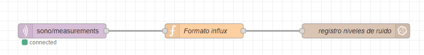
    Dentro de este nodo debe escribirse el siguiente código:

    ```javascript
    let values = msg.payload.values;
    let times = msg.payload.time;
    let nodeId = msg.payload.nodeId;

    let result = [];

    for (let i = 0; i < values.length; i++) {
        let leqObject = { "leq": values[i], "time": times[i] };
        let nodeObject = { "nodo": nodeId };
        result.push([leqObject, nodeObject]);
    }

    msg.payload = result;
    return msg;
    ```
4. Por último revisa la gráfica de las mediciones desde el **DATA EXPLORER** en la interfaz gráfica de InfluxDB:
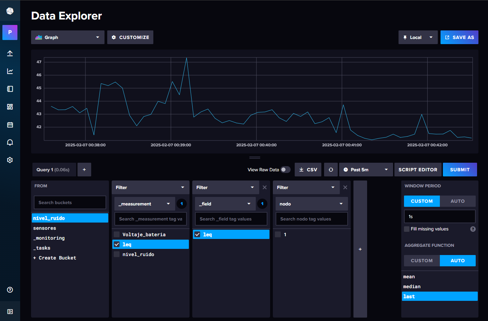
---
